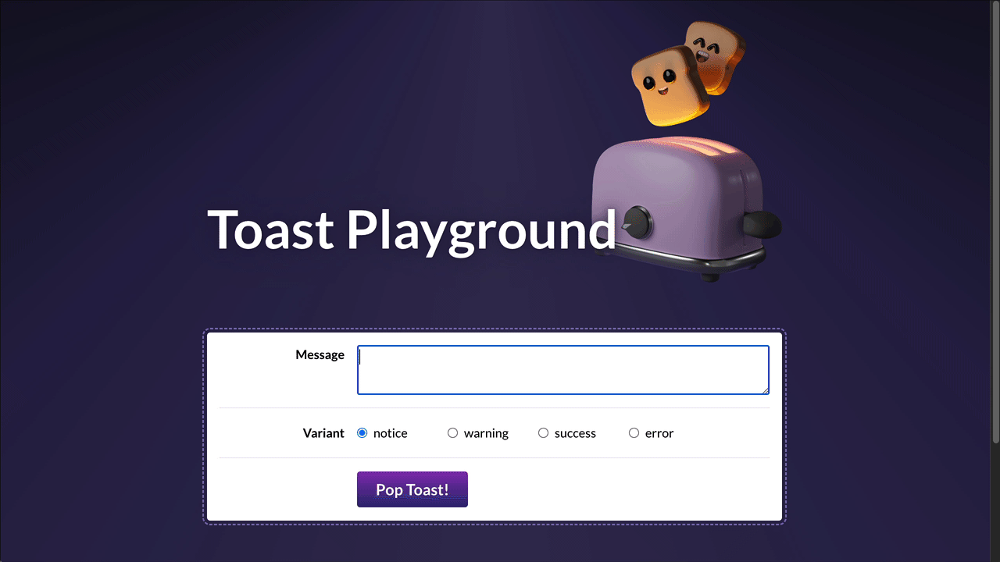
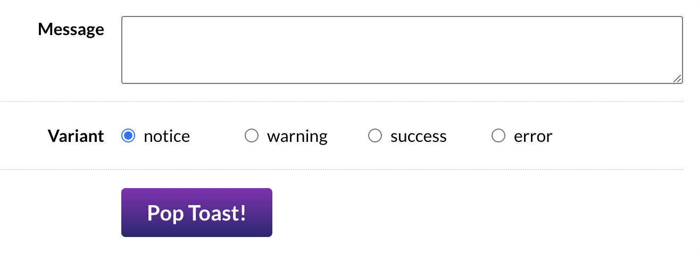
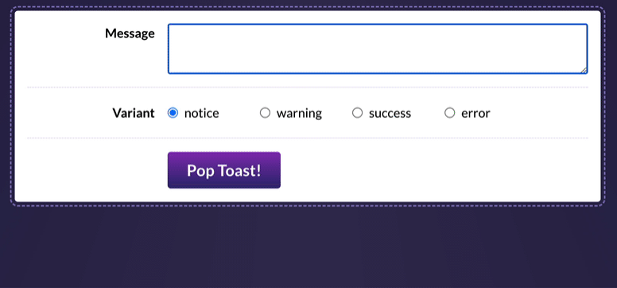
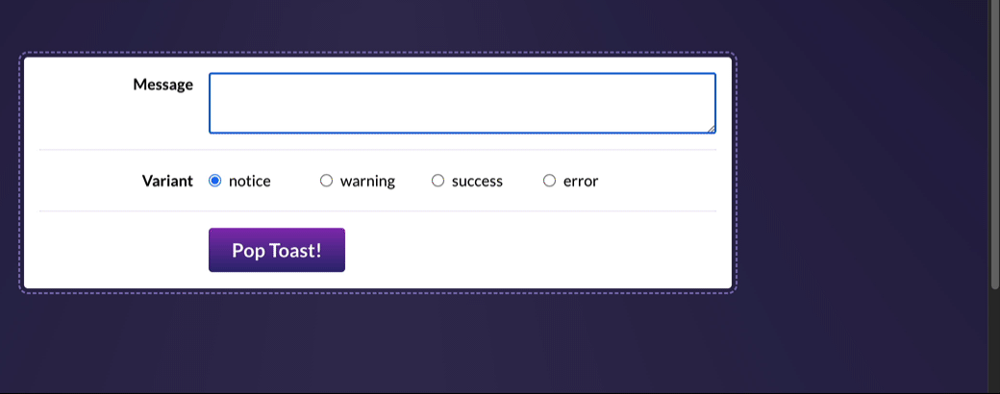

# Toast Component Project

## Joy of React, Project II

In this project, we'll dive deep into the implementation of a single common UI component: A `<Toast>` message component.



## Getting Started

This project is created with create-react-app. It's intended to be run locally, on your computer, using Node.js and NPM.

During the first project, Wordle, we saw how to run a local development server. If you're not quite sure how to get started, I recommend reviewing the [“Local Development” instructions](https://courses.joshwcomeau.com/joy-of-react/project-wordle/03-dev-server) lesson.

To jog your memory, here are the terminal commands you'll need to run:

```bash
# Install dependencies:
npm install

# Run a development server:
npm run start
```

To create new components, you can use this helper script. It saves you a bit of time, creating all the files and adding the standard code:

```bash
# Create a new component:
npm run new-component [TheNewComponentName]
```

---

## Exercise 1: Wiring up form controls

In order to test our `Toast` component, we'll start by building a little playground. This will allow us to test our component throughout development.



In `ToastPlayground.js`, you'll find most of the markup you'll need, but there are two problems:

1. All of the inputs are _uncontrolled_, meaning we can't easily access their values in React. We should use React state to drive all form controls.
2. We're only given a single radio button. We need one for each valid variant.

Our `Toast` component should support 4 different variants:

- notice
- warning
- success
- error

**This first exercise is meant to be a review of the concepts learned in Module 1 and Module 2.** So, it might be worth brushing up on some of those earlier lessons. In particular, the [Input Cheatsheet bonus lesson](https://courses.joshwcomeau.com/joy-of-react/02-state/11-bonus-cheatsheet) has some handy info about binding different types of form inputs!

**Acceptance Criteria:**

- The “Message” textarea should be driven by React state
- Using the data in the `VARIANT_OPTIONS` array, render 4 radio buttons within the “Variant” row. They should all be part of the same group (so that only one can be selected at a time). They should also be driven by React state.
- There should be no key warnings in the console.

---

## Exercise 2: Live-editable toast preview

Inside `src/components`, you'll find a `Toast` component. This component includes the basic DOM structure you'll need, but **it's entirely static right now.** It doesn't accept any props!

Your mission in this exercise is to render the `Toast` component within `ToastPlayground` and allow the playground to customize the Toast using the state we set up in the previous exercise. We should also figure out a "dismissal" mechanism, so that the close button functions.

Here's what it should look like, when you've solved this exercise:



For now, you can import the `Toast` component in `ToastPlayground` and render it between the header and the controls:

```jsx
<header>
  
  <h1>Toast Playground</h1>
</header>

{/* Place a <Toast /> here! */}

<div className={styles.controlsWrapper}>
  <div className={styles.row}>
```

**It's up to you to come up with the best possible “Prop API” for this component!**

If you get stuck, you may wish to review the following lessons from the course:

- [Styling in React, exercises](https://courses.joshwcomeau.com/joy-of-react/01-fundamentals/09.02-styling-exercises)
- [Slots, exercises](https://courses.joshwcomeau.com/joy-of-react/04-component-design/07.01-slots-exercises) (Especially the stretch goal from the first exercise!)

**Acceptance Criteria:**

- The toast component should show the message entered in the textarea, essentially acting as a “live preview”.
- The toast's styling should be affected by the “variant” selected:
  - The colors can be set by specifying the appropriate class on the top-level `<div>`. By default, it's set to `styles.notice`, but you'll want to dynamically select the class based on the variant (eg. for a success toast, you'll want to apply `styles.success`).
  - The icon can be selected from the `ICONS_BY_VARIANT` object. Feel free to re-organize things however you wish!
- The toast should be hidden by default, but can be shown by clicking the "Pop Toast!” button.
- The toast can be hidden by clicking the “×” button within the toast.

---

## Exercise 3: Toast shelf

One of the core defining characteristics of toast notifications is that they stack!


Your mission in this exercise is to restructure things so that our `ToastPlayground` allows us to create _multiple_ toasts.

To help in your quest, you'll find a `ToastShelf` component in this project. It will automatically apply the styles and animations.

You'll need to replace the `Toast` live demo with this new `ToastShelf` component, inside `ToastPlayground`:

```diff
<header>
  
  <h1>Toast Playground</h1>
</header>

- <Toast />
+ <ToastShelf />

<div className={styles.controlsWrapper}>
  <div className={styles.row}>
```

By the end of this exercise, it should look like this:



**This is a very tricky exercise.** If you're not sure where to start / how to make this work, I share some [hints on the course platform](https://courses.joshwcomeau.com/joy-of-react/project-toast/03-hints).

Some lessons that might help, from the course:

- [The onClick Parable](https://courses.joshwcomeau.com/joy-of-react/02-state/04.02-on-click-parable)
- [Dynamic key generation](https://courses.joshwcomeau.com/joy-of-react/02-state/07-key-generation)

**Acceptance Criteria:**

- Instead of live-editing a single Toast instance, the playground should be used to push new toast messages onto a stack, rendered inside `ToastShelf` and shown in the corner of the page.
- When “Pop Toast!” is clicked, the message/variant form controls should be reset to their default state (`message` should be an empty string, `variant` should be "notice").
- Clicking the “×” button inside the toast should remove that specific toast (but leave the rest untouched).
- A proper `<form>` tag should be used in the `ToastPlayground`. The toast should be created when submitting the form.
- **There should be no key warnings in the console!** Keys should be unique, and you should not use the index.

---

## Exercise 4: Context

As it stands, all of our state has been managed by `ToastPlayground`. This works for our little demo app, but it wouldn't scale well in a real-world application!

In this exercise, we'll refactor our application to use the [“Provider component” pattern](https://courses.joshwcomeau.com/joy-of-react/04-component-design/08.04-provider-component). It will own all of the state related to the toasts state, and make it available to any child component who requires it.

**Acceptance Criteria:**

- Create a new component, `ToastProvider`, that will serve as the “keeper” for all toast-related state.
  - To generate a new component, you can use the “new-component” script! Try tunning `npm run new-component ToastProvider` in the terminal.
- Components that require the state should pull it from context with the `useContext` hook, rather than passing through props.
- As we saw in the [“Provider Components” lesson](https://courses.joshwcomeau.com/joy-of-react/04-component-design/08.04-provider-component), we can also share _functions_ that allow consumers to alter the state. Consider making functions available that will create a new toast, or dismiss a specific toast.
- This is a “refactor” exercise. The user experience shouldn't change at all.

---

## Exercise 5: Keyboard and screen reader support

Our component so far works pretty well for sighted mouse users, but the experience isn't as great for everyone else.

In this exercise, we'll improve the experience for two different groups of people:

- Sighted keyboard users
- Users who use a screen reader

### 5.1: Keyboard users

Let's try something. Pretend that you don't have a mouse or trackpad. Using the keyboard alone, can you create and dismiss a toast message?

**Give it a shot now, in browser.**

**How do I do this?** You'll use the “Tab” key to move focus between interactive elements. You can hold "Shift" and hit "Tab" to move backwards. In order to dismiss the toasts, you'll need to keep tabbing until your focus reaches the close button. Then, hit "Enter".

> NOTE: If you're using Safari or Firefox on MacOS, you'll need to toggle a system setting to allow tabs to focus on buttons. Read more here: https://www.scottohara.me/blog/2014/10/03/link-tabbing-firefox-osx.html

---

Well, what did you think?

I found that this experience was pretty annoying. It was difficult to get the focus to reach the close buttons.

When we built a modal from scratch, we moved focus to within the modal, and trapped it there. This is a good idea for modals (which are urgent and blocking), but it's not the right approach for toasts (which are non-urgent and passive). Moving the user's focus is a pretty aggressive move, and not something we should do unless it's necessary.

**So, here's what we should do:** Let's wire up the "Escape" key to automatically dismiss all toasts.

That way, we aren't interrupting the user. They can read the messages in their own time, and hit "Escape" to dismiss them, without them needing to fuss with tab navigation at all.

**Acceptance Criteria:**

- Hitting the "Escape" key should dismiss all toasts
- You'll want to do this with a `useEffect` hook, but it's up to you to decide which component should bear this responsibility.

### 5.2: Screen reader users

A screen reader is a piece of software that narrates the page. They're primarily used by folks who are blind or have low vision (though screen readers are also useful for folks with cognitive disabilities).

Understanding how to use screen readers is a bit beyond the scope of this course, so I won't ask you to test things with a screen reader.

Let's imagine we reach out to an accessibility specialist, and they do us the favor of converting our HTML to be screen-reader-friendly.

**Here are the changes we need to make:**

```diff
<ol
  class="ToastShelf_wrapper"
+ role="region"
+ aria-live="assertive"
+ aria-label="Notification"
>
  <li class="ToastShelf_toastWrapper">
    <div class="Toast_toast Toast_error">
      <div class="Toast_iconContainer">
        <!-- Variant SVG icon -->
      </div>
      <p class="Toast_content">
+       <div class="VisuallyHidden_wrapper">
+         error -
+       </div>
        Something went wrong! Please contact customer support
      </p>
      <button
        class="Toast_closeButton"
+       aria-label="Dismiss message"
+       aria-live="off"
      >
        <!-- Close SVG icon -->
-       <div class="VisuallyHidden_wrapper">
-         Dismiss message
-       </div>
      </button>
    </div>
  </li>
</ol>
```

**NOTE: This diff shows the _HTML_.** Pretend that this is an HTML snippet given to you by an accessibility consultant who doesn't know React. Your job is to integrate their suggestions into our React components.

**Curious about these changes?** In the solution video, I'll share exactly why each of these changes are necessary. I realize it probably seems pretty arbitrary right now 😅 but all will be explained in the video.

**Acceptance Criteria:**

- The `<ol>` should have the specified role / aria tags
- The toast's content should be prefixed with the variant, using the `VisuallyHidden` component.
  - _NOTE:_ The diff above shows an _error_ toast, but the prefix should be dynamic, based on the variant.
- The “Dismiss message” content in the close button should be moved to an `aria-label`. `aria-live` should also be set to "off".

---

## Exercise 6: Extracting a custom hook

Whew! We've done quite a bit with this lil’ `Toast` component!

In the previous exercise, we added an “escape” keyboard shortcut, to dismiss all toasts in a single keystroke. This is a very common pattern, and it requires a surprising amount of boilerplate in React.

Let's build a **custom reusable hook** that makes it easy to reuse this boilerplate to solve future problems.

There are lots of different ways to tackle this, and there's no right or wrong answer, but here's one idea to get you started: what if we create a new custom hook called `useEscapeKey`?

```js
useEscapeKey(() => {
  // Code to dismiss all toasts
});
```

**This is an open-ended exercise.** Feel free to experiment with different APIs and see what works best for you!

**Acceptance Criteria:**

- We want to create a new generic hook that makes it easy to listen for `keydown` events in React. It's up to you to come up with the best “consumer experience”.
- Because this is a generic hook, it shouldn't be stored with the `ToastProvider` component. Create a new `/src/hooks` directory, and place your new hook in there.
- The `ToastProvider` component should use this new hook.
- **Make sure there are no ESLint warnings.**
  - In VSCode, ESLint warnings are shown as squiggly yellow underlines. You can view the warning by hovering over the underlined characters, or by opening the “Problems” tab (`⌘` + `Shift` + `M`, or Ctrl + `Shift` + `M`).
